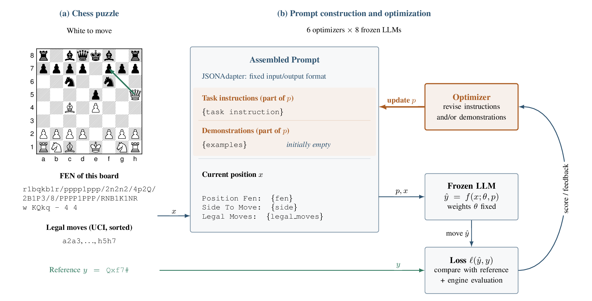

<div align="center">

# Benchmarking Prompt Optimization of LLMs With Chess

### A cheap, exactly scored, and renewable benchmark for automatic prompt optimization (APO)

[](https://arxiv.org/abs/2610.00416)
[](LICENSE)
[](pyproject.toml)
[](https://database.lichess.org/#puzzles)

<p>
  <a href="#overview">Overview</a> ·
  <a href="#results">Results</a> ·
  <a href="#installation">Installation</a> ·
  <a href="#quick-start">Quick Start</a> ·
  <a href="#data">Data</a> ·
  <a href="#architecture">Architecture</a> ·
  <a href="#scope-of-this-release">Scope</a> ·
  <a href="#citation">Citation</a>
</p>

</div>

---

## Overview

<div align="center">

**1,118 Lichess puzzles · 6 APO algorithms · 8 frozen target models**

</div>


This repository contains code and data for the paper
[*Benchmarking Prompt Optimization of Large Language Models With Chess*](https://arxiv.org/abs/2610.00416).
A frozen LLM is given a chess position (FEN, side to move, legal moves) and must
return the reference move. An optimizer improves the prompt's instructions and/or
demonstrations; the model weights never change.

- **Cheap, exact scoring:** each puzzle is solved only if every solver move matches the reference.
- **Six optimizers via [DSPy](https://dspy.ai):** GEPA, MIPROv2, SIMBA, COPRO, BootstrapFewShot (BFS), BootstrapFewShotWithRandomSearch (BRS).
- **Eight target models:** GPT-4o Mini, Jev 1.13, Qwen3.8 27B, Claude Haiku 4.5, DeepSeek V4 Pro, Gemini 3.5 Flash Lite, GPT-5.6 Luna, Muse Spark 1.2. Gemini 3.5 Flash serves as the fixed meta-model.
- **Renewable:** a script draws fresh puzzle sets from the latest Lichess snapshot.

<sub>Right: cost vs. accuracy, baseline prompt (circle) → best optimizer (star). Paper, Figure 2a.</sub>

<br clear="right">

---

## Results

**Interactive explorer:** the static site in [`site/`](site/) plots inference
cost against puzzle accuracy for every model × optimizer, with the Pareto
frontier and the compiled prompt of every run one click away. See
[`docs/results-site.md`](docs/results-site.md) for local preview and GitHub Pages
deployment.

Four of eight models improve over their baseline (one-sided Welch test, p < 0.05,
unadjusted). The largest gain is Gemini 3.5 Flash Lite, +7.57 points with SIMBA.
No optimizer wins on every model.

<details>
<summary><b>Full results table (paper, Table 3)</b></summary>

<br>

**Puzzle accuracy (%, N = 559, mean ± SD over three seeds)**

| Model | Baseline | BFS | BRS | COPRO | GEPA | MIPROv2 | SIMBA |
| :--- | ---: | ---: | ---: | ---: | ---: | ---: | ---: |
| GPT-4o Mini | 5.84 ±0.37 | 5.01 ±0.31 | 4.95 ±0.99 | 5.84 ±0.55 | 5.66 ±0.52 | 4.95 ±0.81 | **5.90 ±0.36** |
| Jev 1.13 † | 7.27 ±0.10 | 7.87 ±0.47 | 8.77 ±0.31\* | 7.69 ±0.18\* | **9.30 ±0.47**\* | 8.59 ±0.65\* | N.A. |
| Qwen3.8 27B † | 8.47 ±0.37 | 9.48 ±0.36\* | 9.78 ±0.41\* | 9.12 ±0.31\* | **10.44 ±0.90**\* | 8.23 ±0.31 | 9.36 ±0.45\* |
| Claude Haiku 4.5 | 11.63 ±0.00 | 11.09 ±0.18 | 11.21 ±1.02 | N.U. | **12.28 ±1.22** | 10.61 ±1.19 | 11.39 ±0.63 |
| DeepSeek V4 Pro 0813 † | 14.49 ±0.18 | 14.55 ±0.63 | 14.85 ±1.00 | 14.79 ±0.27 | **16.28 ±0.31**\* | 14.49 ±0.62 | 15.03 ±0.82 |
| Gemini 3.5 Flash Lite † | 26.30 ±0.62 | 32.38 ±0.47\* | 33.21 ±1.15\* | 29.10 ±3.46 | 27.01 ±0.18 | 32.98 ±1.72\* | **33.87 ±1.03**\* |
| GPT-5.6 Luna | **31.72 ±0.37** | 23.20 ±1.79 | N.U. | 30.95 ±1.46 | 31.48 ±1.17 | 30.05 ±0.78 | N.U. |
| Muse Spark 1.2 Contributor | 31.90 ±1.49 | 28.92 ±1.97 | 30.59 ±0.36 | N.U. | 32.20 ±1.40 | 29.93 ±1.14 | **32.74 ±1.09** |

<sub>Bold: highest mean per model. \* Improvement over the baseline (one-sided Welch test, p < 0.05, unadjusted). † At least one starred optimizer. N.U.: no seed changed the original prompt. N.A.: not applicable (SIMBA needs temperature sampling, which Jev does not support).</sub>

</details>

<div align="center">

<br><sub>Per-seed accuracy change from baseline, by optimizer. Paper, Figure 2b.</sub>
</div>

**Raw observations behind every plot and table** are in
[`results/paper/`](results/paper/README.md): per-position responses with
tokens, cost, latency and engine regret (`independent_positions.csv.gz`), the
compiled prompts (`prompts.csv`), game-play rollouts (`rollouts.csv.gz`), and a
manifest with the schema, coverage, settings, and file hashes. The data
dictionary describes every column and how the tables join.

---

## Installation

Requires Python 3.11+ and [uv](https://docs.astral.sh/uv/).

```bash
git clone https://github.com/imec-ailabs/Automatic-Prompt-Optimization-with-Chess.git
cd Automatic-Prompt-Optimization-with-Chess
uv sync --dev
export OPENROUTER_API_KEY=...
```

All models, including the meta-model, run through OpenRouter. Jev uses
OpenRouter's alpha decisions endpoint, so your key needs access to it.

## Quick Start

```bash
# Zero-training baseline (20 positions, Gemini 3.5 Flash Lite)
uv run chess-bench evaluate configs/independent_positions_baseline.yaml

# Small GEPA optimization, then held-out evaluation
uv run chess-bench evaluate configs/independent_positions_gepa.yaml

# Same for Jev (decision endpoint)
uv run chess-bench evaluate configs/independent_positions_jev_baseline.yaml
uv run chess-bench evaluate configs/independent_positions_jev_gepa.yaml
```

[`configs/`](configs/) has one baseline per paper model; the unsuffixed one uses
Gemini 3.5 Flash Lite. Each example evaluates at most 20 positions so it runs
in minutes; [docs/paper-configs.md](docs/paper-configs.md) explains how to run
the paper's full protocol.

Each run writes:

```text
runs/<name>/
├── compiled.json       # optimized DSPy program; omitted for baselines
├── results.json        # one record per held-out position (source_id, rating,
│                       #   move_index/solver_length, prediction, correct)
├── run_config.json     # resolved configuration and dataset hashes
└── summary.json        # metrics, timing, and token/cost usage per phase
```

`summary.json` reports position-level `accuracy` and the paper's per-puzzle
`source_record_accuracy` (every solver position of a puzzle must be correct),
plus `compile_usage` (task and prompt model) and `evaluation_usage` with call
counts, tokens, and cost as reported by the provider; `usage_complete: false`
means some calls returned no usage metadata.

Supported `method` values: `baseline`, `gepa`, `mipro_v2`, `simba`, `copro`,
`bootstrap_few_shot`, `bootstrap_random_search`. Omitting the `optimizer` block
runs the paper's settings (Appendix B.6, Table 11; `auto: heavy` for GEPA and
MIPROv2), so the example configs override them to stay small. See
[docs/paper-configs.md](docs/paper-configs.md) for per-model settings, full-data
runs, and the three seeds (42, 43, 44).

Runs stop at the first provider or configuration error. Set
`continue_on_error: true` to record failed calls as incorrect instead.

> **Note:** A 20-position run can stop mid-puzzle. `source_record_accuracy` is
> computed only over puzzles whose positions were all evaluated
> (`source_records_complete`), so comparing with the paper needs the full test set.

---

## Data

`data/puzzle_train.csv` and `data/puzzle_test.csv` hold the paper's 559 + 559
puzzles from the [Lichess puzzle database](https://database.lichess.org/#puzzles) (CC0).

The two files do not overlap in puzzle IDs or `(FEN, Moves)` lines and share
the same composition, stratified by rating and solver length: 20 puzzles per
100-point rating bin from 400 to 2000, 30 per bin from 2000 to 2800, half of
them mate puzzles, with 1 to 5 solver moves. The `NumMoves`, `RatingBin`,
`Mate`, `GameId`, and `GameSAN` columns record that construction. Every
`run_config.json` stores the SHA-256 of the data files a run used.

To draw a fresh set from the latest Lichess snapshot:

```bash
uv run python scripts/generate_puzzle_datasets.py --refresh-source --overwrite
```

> **Warning:** `--overwrite` replaces the paper's `data/puzzle_train.csv` and
> `data/puzzle_test.csv`. Use `--train-output` / `--test-output` to write elsewhere.

The snapshot is cached at `data/lichess_db_puzzle.csv.zst`; reusing it with the
same seed gives the same datasets, and the command prints the snapshot's
SHA-256 to record with your results. Puzzles are drawn uniformly at random from
the snapshot; `--min-rating`, `--max-rating`, `--solver-moves`, and `--theme`
narrow the pool. Run with `--help` for all options.

## Architecture

<div align="center">

<br><sub>How the benchmark works. Paper, Figure 1.</sub>
</div>

### Benchmark loop

1. **Expand puzzles into positions.** Each Lichess puzzle is replayed along its
   reference line; every solver turn becomes one independent position
   (FEN, side to move, sorted legal moves) with one reference move.
2. **Prompt a frozen model.** A DSPy program wraps the position in a fixed
   JSON input/output format. Only the task instruction and demonstrations
   (the prompt *p*) can change.
3. **Score.** The returned move is matched against the reference. Unparseable
   or illegal answers count as wrong. A puzzle is solved only if all its
   positions are correct.
4. **Optimize.** On the training split, an optimizer revises *p* using the
   scores and, for GEPA and SIMBA, textual feedback (parse error, illegal
   move, or legal but wrong). For GEPA, MIPROv2, SIMBA and COPRO, Gemini 3.5
   Flash proposes the new prompts; BFS and BRS only select demonstrations.
5. **Evaluate.** The selected prompt runs once over the held-out test set.

### Repository layout

```text
├── configs/                     # one YAML per run (model, method, budgets, seed)
├── data/                        # paper train/test puzzles (559 + 559)
├── results/paper/               # observations behind the paper's plots and tables
├── scripts/
│   ├── generate_puzzle_datasets.py   # draw fresh puzzle sets from Lichess
│   └── build_results_site.py    # build the interactive results page in site/
├── src/chess_self_improvement/
│   ├── cli.py                   # `chess-bench evaluate <config.yaml>`
│   ├── runner.py                # config → splits → optimize → evaluate → runs/<name>/
│   ├── datasets.py              # load Lichess CSVs
│   ├── benchmarks/
│   │   └── independent_positions.py  # puzzle → positions, exact-move metrics, feedback
│   ├── dspy_program.py          # DSPy signature with the baseline instruction
│   ├── moves.py                 # parse model output into a legal move
│   ├── jev.py                   # Jev decision-endpoint adapter
│   ├── dspy_usage.py            # token and cost accounting
│   └── optimization/            # optimizer factory and strict per-optimizer parameters
├── docs/paper-configs.md        # per-model settings and how to run the full paper setup
└── tests/                       # offline tests, no live API calls
```

---

## Scope of this release

**Included:** puzzle data, the six optimizers plus baseline, per-model configs,
the dataset-renewal script, and the paper's raw observations under
[`results/paper/`](results/paper/README.md): per-position results including
engine-based regret (Appendix B.2) and cross-model transfer (Section 5.4),
compiled prompts, and Stockfish game-play rollouts (Section 5.5).

**Not included:** the code that ran the regret, transfer, and rollout
experiments, the scripts that exported `results/paper/`, and the
plotting scripts. To score regret or run game-play rollouts yourself, use
Stockfish 18 at depth 20 for both, as in the paper.

## Development

```bash
uv run pytest
uv run ruff check .
uv run mypy src tests
```

The test suite never calls live model APIs.

---

## Citation

If you use this benchmark, please cite the paper (GitHub's "Cite this repository"
uses [`CITATION.cff`](CITATION.cff)):

```bibtex
@article{lesort2026chessapo,
  title   = {Benchmarking Prompt Optimization of Large Language Models With Chess},
  author  = {Lesort, Timoth{\'e}e and L{\'o}pez de Aberasturi G{\'o}mez, Alejandra and Karch, Tristan and Veniat, Tom and Modard, Philippe and Tuyls, Karl and Denoyer, Ludovic},
  journal = {arXiv preprint arXiv:2610.00416},
  year    = {2026}
}
```

## License

Code is released under the [Apache License 2.0](LICENSE) (see also [NOTICE](NOTICE)).
It depends on [python-chess](https://github.com/niklasf/python-chess) (GPL-3.0+),
which is installed separately and not bundled.
Puzzle data in `data/` comes from Lichess under CC0 1.0. The result data in
`results/paper/` is released under
[CC BY 4.0](https://creativecommons.org/licenses/by/4.0/); see its
[README](results/paper/README.md) for details.

---

<div align="center">
<sub>imec AI.labs · <a href="https://github.com/imec-ailabs/Automatic-Prompt-Optimization-with-Chess/issues">Report an issue</a></sub>
</div>
