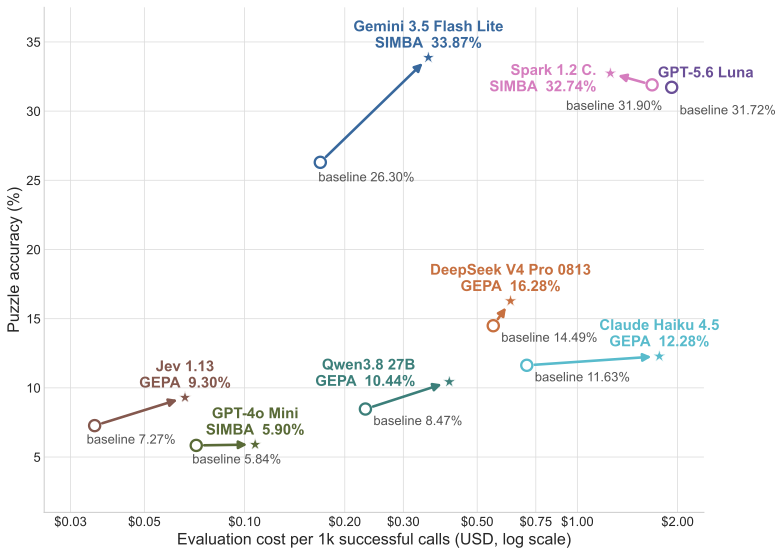
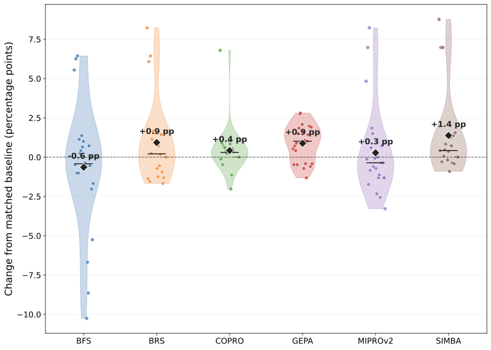

# Benchmarking Large Language Model Prompt Optimization With Chess

Local code and data accompanying the paper, supporting the independent-position
task:

- choose the reference move in independent chess positions.

The repository evaluates a zero-training DSPy baseline and six prompt optimizers:
GEPA, MIPROv2, SIMBA, COPRO, BootstrapFewShot, and
BootstrapFewShotWithRandomSearch. Runs execute in one local Python process. There
is no cluster, Temporal, Azure, or internal imec dependency.

The examples cover the paper's eight target models and fixed Gemini 3.5 Flash
meta-model. They are **bounded starting points, not a complete archival
reproduction** of the paper's runs, budgets, prompts, or plots.

## Paper Results

**Table 2.** Accuracy (%) over **559 source records**, each counted correct only
when **all its solver positions** are correct. Values are mean with sample
standard deviation over three runs, shown in compact type. This is not position-level
accuracy, which the local independent-position task reports separately.

| <sub>Model</sub> | <sub>Baseline</sub> | <sub>BFS</sub> | <sub>BRS</sub> | <sub>COPRO</sub> | <sub>GEPA</sub> | <sub>MIPROv2</sub> | <sub>SIMBA</sub> |
| --- | ---: | ---: | ---: | ---: | ---: | ---: | ---: |
| <sub>GPT-4o Mini</sub> | <sub>5.84 &plusmn;0.37</sub> | <sub>5.01 &plusmn;0.31</sub> | <sub>4.95 &plusmn;0.99</sub> | <sub>5.84 &plusmn;0.55</sub> | <sub>5.66 &plusmn;0.52</sub> | <sub>4.95 &plusmn;0.81</sub> | <sub><strong>5.90 &plusmn;0.36</strong></sub> |
| <sub>Jev 1.13<sup>&dagger;</sup></sub> | <sub>7.27 &plusmn;0.10</sub> | <sub>7.87 &plusmn;0.47</sub> | <sub>8.77 &plusmn;0.31<sup>*</sup></sub> | <sub>7.69 &plusmn;0.18</sub> | <sub><strong>9.30 &plusmn;0.47</strong><sup>*</sup></sub> | <sub>8.59 &plusmn;0.65</sub> | <sub>N.A.</sub> |
| <sub>Qwen3.8 27B<sup>&dagger;</sup></sub> | <sub>8.47 &plusmn;0.37</sub> | <sub>9.48 &plusmn;0.36<sup>*</sup></sub> | <sub>9.78 &plusmn;0.41<sup>*</sup></sub> | <sub>9.12 &plusmn;0.31<sup>*</sup></sub> | <sub><strong>10.44 &plusmn;0.90</strong><sup>*</sup></sub> | <sub>8.23 &plusmn;0.31</sub> | <sub>9.36 &plusmn;0.45<sup>*</sup></sub> |
| <sub>Claude Haiku 4.5</sub> | <sub>11.63 &plusmn;0.00</sub> | <sub>11.09 &plusmn;0.18</sub> | <sub>11.21 &plusmn;1.02</sub> | <sub>N.U.</sub> | <sub><strong>12.28 &plusmn;1.22</strong></sub> | <sub>10.61 &plusmn;1.19</sub> | <sub>11.39 &plusmn;0.63</sub> |
| <sub>DeepSeek V4 Pro 0813<sup>&dagger;</sup></sub> | <sub>14.49 &plusmn;0.18</sub> | <sub>14.55 &plusmn;0.63</sub> | <sub>14.85 &plusmn;1.00</sub> | <sub>14.79 &plusmn;0.27</sub> | <sub><strong>16.28 &plusmn;0.31</strong><sup>*</sup></sub> | <sub>14.49 &plusmn;0.62</sub> | <sub>15.03 &plusmn;0.82</sub> |
| <sub>Gemini 3.5 Flash Lite<sup>&dagger;</sup></sub> | <sub>26.30 &plusmn;0.62</sub> | <sub>32.38 &plusmn;0.47<sup>*</sup></sub> | <sub>33.21 &plusmn;1.15<sup>*</sup></sub> | <sub>29.10 &plusmn;3.46</sub> | <sub>27.01 &plusmn;0.18</sub> | <sub>32.98 &plusmn;1.72<sup>*</sup></sub> | <sub><strong>33.87 &plusmn;1.03</strong><sup>*</sup></sub> |
| <sub>GPT-5.6 Luna</sub> | <sub><strong>31.72 &plusmn;0.37</strong></sub> | <sub>23.20 &plusmn;1.79</sub> | <sub>N.U.</sub> | <sub>30.95 &plusmn;1.46</sub> | <sub>31.48 &plusmn;1.17</sub> | <sub>30.05 &plusmn;0.78</sub> | <sub>N.U.</sub> |
| <sub>Muse Spark 1.2 Contributor</sub> | <sub>31.90 &plusmn;1.49</sub> | <sub>28.92 &plusmn;1.97</sub> | <sub>30.59 &plusmn;0.36</sub> | <sub>N.U.</sub> | <sub>32.20 &plusmn;1.40</sub> | <sub>29.93 &plusmn;1.14</sub> | <sub><strong>32.74 &plusmn;1.09</strong></sub> |

Bold preserves the manuscript's best-mean markings, including Luna's baseline.
<sup>*</sup> Improvement over the three-run baseline under an **unadjusted,
one-sided Welch test**, p &lt; 0.05; <sup>&dagger;</sup> at least one starred
optimizer. N.U.: none of the three optimizer seeds updated the original prompt.
N.A.: method not applicable. The manuscript's gray shading for below-baseline
means is omitted for portable GitHub rendering; all values and markers are retained.

<p>
  
  
</p>

**Figure 1 panels.** Left: mean evaluation cost versus mean source-record
accuracy across three seeds, from baseline (open circle) to best algorithm
(star). Right: per-seed accuracy changes from the matched baseline by optimizer.
Rendered from the current local manuscript PDFs; see [source hashes and
limitations](figures/README.md). No old plotting data was substituted.

## Install

Python 3.11 or newer and [uv](https://docs.astral.sh/uv/) are required.

```bash
uv sync --dev
```

Set the API key required by the selected model. The seven generative targets
and meta-model use OpenRouter:

```bash
export OPENROUTER_API_KEY=...
```

Jev uses OpenRouter's decision endpoint, not its generative chat endpoint, with
the same `OPENROUTER_API_KEY` (subject to access to that endpoint). See
[model settings and Jev constraints](docs/paper-configs.md). Generative DSPy
model names follow LiteLLM conventions; changing providers requires the
corresponding credentials and endpoint settings.

## Run

Run a small zero-training evaluation:

```bash
uv run chess-bench evaluate configs/independent_positions_baseline.yaml
uv run chess-bench evaluate configs/independent_positions_jev_baseline.yaml
```

Run bounded prompt optimization followed by held-out evaluation:

```bash
uv run chess-bench evaluate configs/independent_positions_gepa.yaml
uv run chess-bench evaluate configs/independent_positions_jev_gepa.yaml
```

Each run writes:

```text
runs/<name>/
├── compiled.json       # optimized DSPy program; omitted for baselines
├── results.json        # one record per held-out example
├── run_config.json     # resolved configuration and dataset hashes
└── summary.json        # aggregate metrics, timing, and evaluation usage
```

Choose any of the eight standalone independent-position baselines in
[`configs/`](configs/); the unsuffixed baseline uses Gemini 3.5 Flash Lite.
Each evaluates at most 20 independent positions. For full held-out data and
seeds **42, 43, 44**, follow [the configuration guide](docs/paper-configs.md),
including distinct output directories and the record-level scoring caveat.

The supported `method` values are `baseline`, `gepa`,
`mipro_v2`, `simba`, `copro`, `bootstrap_few_shot`, and
`bootstrap_random_search`. Optimizer-specific keys belong under `optimizer` and
are validated strictly.

Runs fail fast on provider or configuration errors. Set `continue_on_error: true`
only when you intentionally want failed calls recorded as incorrect examples.

## Data

`data/puzzle_train.csv` and `data/puzzle_test.csv` are the paper-facing train and
held-out sets derived from the [Lichess puzzle database](https://database.lichess.org/#puzzles).
The original puzzle identifiers and metadata are retained. Lichess database
content is available under CC0; see the upstream dataset page for details.

Independent positions replay each authoritative line and evaluate every solver
turn independently.

### Generate fresh datasets

The public Lichess puzzle snapshot is updated regularly but has no puzzle
creation timestamp. The generator therefore samples from the latest published
snapshot rather than filtering by date. It streams the compressed database and
keeps only the requested sample in memory.

Download the latest snapshot and replace the included 559-row train and test
sets with deterministic, non-overlapping **1,200-source-record splits**:

```bash
uv run python scripts/generate_puzzle_datasets.py --refresh-source --overwrite
```

By default, each split contains **20 source records per cell** across 12 rating
bands (400-599, 600-799, ..., 2600-2799) and 5 solver-move counts (1-5).
Solver moves exclude the initial setup move and count every other move after it.
Records outside this grid are excluded. The generator validates reference lines,
reservoir-samples 40 records per cell, randomly divides each cell 20/20, and
shuffles each split using `--seed` (default: 42). `--per-cell N` changes the
per-split quota, producing `60 * N` source records in each split.

Every cell must meet the combined quota after filtering. If any cell is short,
the command reports all 60 cell counts and the required quota, leaving both
outputs untouched even with `--overwrite`. Selected IDs are unique across all
cells and splits. Only retained IDs are tracked: repeated IDs that are no longer
selected may re-enter sampling, so counts are not a full-source distinct-ID census
and duplicate-heavy input does not give uniform sampling over distinct IDs.

These are **fresh datasets, not the paper's 559-record sets**. The default grid
provides 3,600 independent positions per split. For full-data runs set
`train_limit: 0`, `test_limit: 0`, and, for example, `validation_size: 300`
(900 training / 300 validation source records, split before position expansion).
These settings replace the 559-record assumptions in the configuration guide;
the shipped bounded configs are not changed by generation.

The compressed snapshot is cached at `data/lichess_db_puzzle.csv.zst`. Reusing
that file without `--refresh-source` and with the same seed produces the same
datasets. The command prints its SHA-256 digest; record it with experiment
results because the upstream snapshot changes over time.

To use a previously downloaded `.csv.zst` or uncompressed `.csv` with rating or
solver-move filters, select legacy random sampling with explicit sizes:

```bash
uv run python scripts/generate_puzzle_datasets.py \
  --source /path/to/lichess_db_puzzle.csv.zst \
  --train-size 559 \
  --test-size 559 \
  --min-rating 1800 \
  --max-rating 2200 \
  --solver-moves 1 \
  --theme fork \
  --seed 42 \
  --overwrite
```

Repeat `--theme` to require multiple themes; this also works in balanced mode if
every cell meets its quota. Rating and solver-move filters require random mode.
Either `--train-size` or `--test-size` selects random sampling without cell quotas;
the unspecified size defaults to 559. Explicit `--per-cell` cannot be combined
with either size option. Run with `--help` for all output and download options.
Source terms and snapshot details are published at
<https://database.lichess.org/#puzzles>.

## Development

```bash
uv run pytest
uv run ruff check .
uv run mypy src tests
```

Live provider calls are never made by the test suite.
